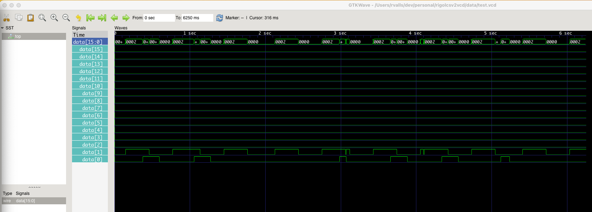
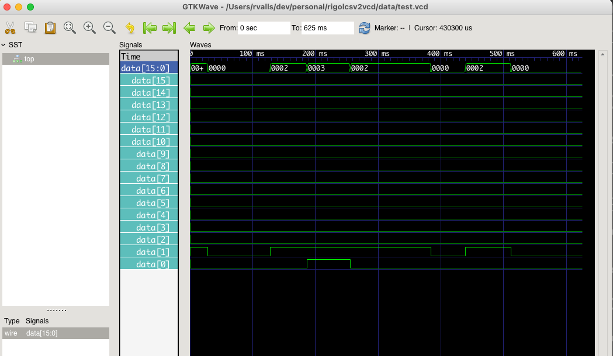

# Rigol CSV to VCD converter

This (WIP) crate intends to transform the CSV output from a [Rigol PLA2216 logic analyser probe][PLA2216] to [VCD format][VCD].

## Quickstart

```shell
cargo run --release < data/test1.csv
```

## Data inputs/outputs

From Rigol support:

> The instrument is combining LA channels D0-D7 together, so that channel 0 is bit 0 and channel 7 is bit 7, this would be the same for LA channels D8-D15.

So the goal is to convert this string data:

```
Time(s),D7-D0,D15-D8,t0 = -0.01s, tInc = 1e-09,
-9.999999E-03,0.000000E+00,0.000000E+00,,
-9.999998E-03,0.000000E+00,0.000000E+00,,
(...)
```

To vectors on the VCD output (not necessarily equivalent to the above CSV, just illustrative):

```
$timescale 1 ns $end
$scope module top $end
$var wire 16 # data $end
$upscope $end
$enddefinitions $end
$dumpvars
b0000000000000000 #
$end
#9999995
b0000000000000001 #
#9999996
b0000000000000010 #
#9999997
b0000000000000011 #
#9999998
b0000000000000000 #
#9999999
```

## Current status
How it started (Rigol oscilloscope screenshot):


Hot it's going (VCDs converted from CSV at different timescales):




As one can see, there's still some bugs to iron out (or report upstream).

[PLA2216]: https://rigolshop.eu/accessories/probe/mso5000/pla2216.html
[VCD]: https://en.wikipedia.org/wiki/Value_change_dump
[python_1]: https://github.com/vidavidorra/rigol-csv-analyser
[python_2]: https://github.com/carlos-jenkins/csv2vcd
[1]: https://crates.io/crates/vcdump
[2]: https://github.com/kevinmehall/rust-vcd
[3]: https://crates.io/crates/vcd-ng
[4]: https://crates.io/crates/vcd
[5]: https://crates.io/crates/vcd_rust
[vcd_rust_viz]: https://github.com/psurply/dwfv
